# Proyecto de Consumo de APIs con React

## Descripción

Este proyecto tiene como objetivo desarrollar aplicaciones web utilizando React, TypeScript y Vite para consumir información desde APIs públicas. Cada integrante implementó una propuesta diferente aplicando componentes reutilizables, diseño responsivo y consumo de datos mediante peticiones HTTP.

## Integrantes

* Sarai Soto
* Angie Portocarrero

## Tecnologías Utilizadas

* React
* TypeScript
* Vite
* Tailwind CSS
* shadcn/ui
* Git
* GitHub
* APIs Públicas

---

# Desarrollo de Sarai Soto

## Descripción

Implementación de una aplicación web basada en la API de Dragon Ball, permitiendo visualizar información de personajes mediante una interfaz moderna y dinámica.

### Evidencia 1

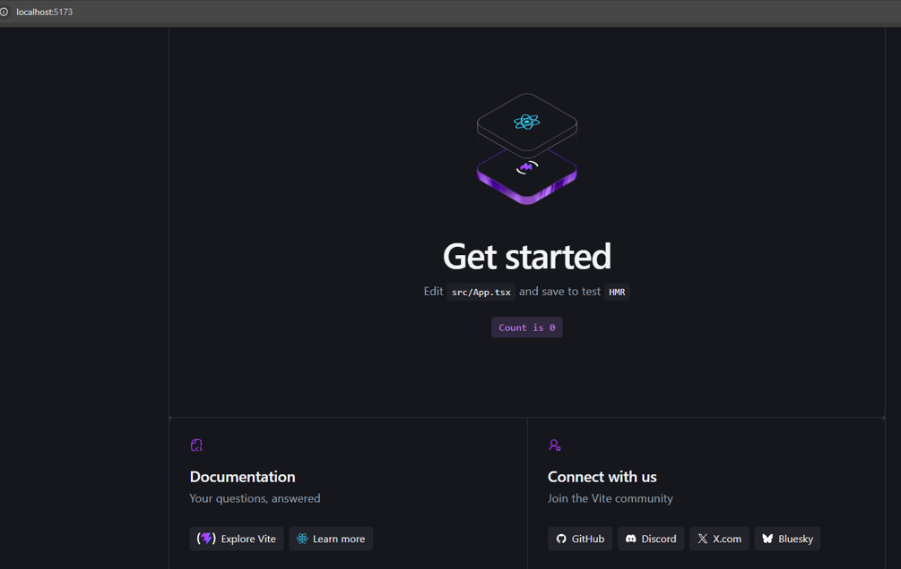

Ejecución inicial del proyecto React con Vite, verificando que el entorno de desarrollo funciona correctamente en localhost:5173.

### Evidencia 2

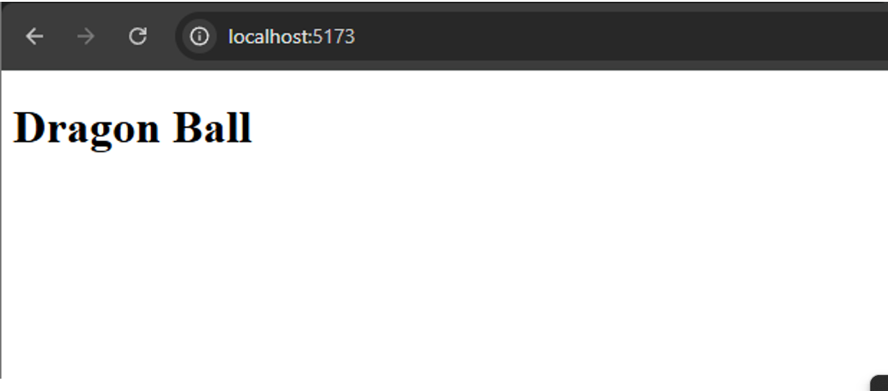

Primera versión de la página principal mostrando el título "Dragon Ball" como base estructural de la aplicación.

### Evidencia 3

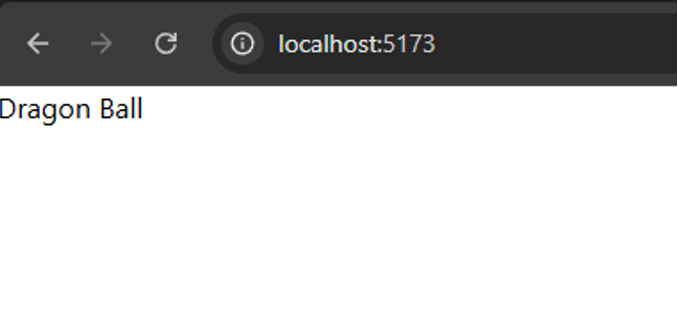

Avance del desarrollo con la integración de estilos iniciales y configuración de componentes en la interfaz.

### Evidencia 4

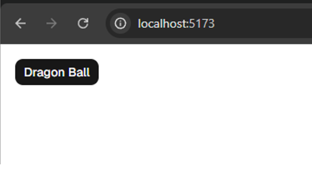

Implementación del botón principal con estilos aplicados mediante Tailwind CSS y shadcn/ui.

### Evidencia 5

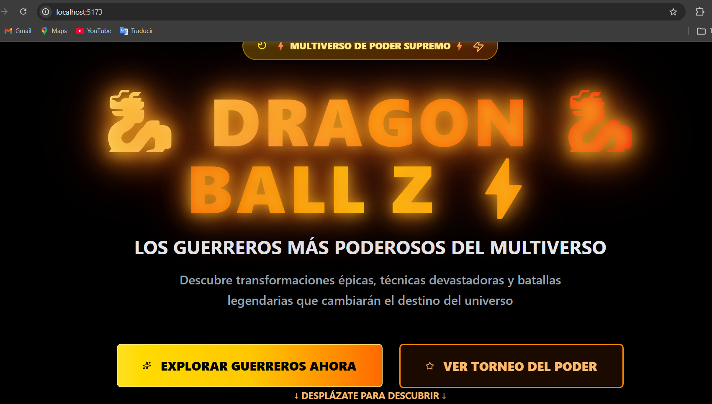

Vista del hero de la landing page con el diseño final en tema oscuro, título animado "Dragon Ball Z" y botones de navegación.

### Evidencia 6

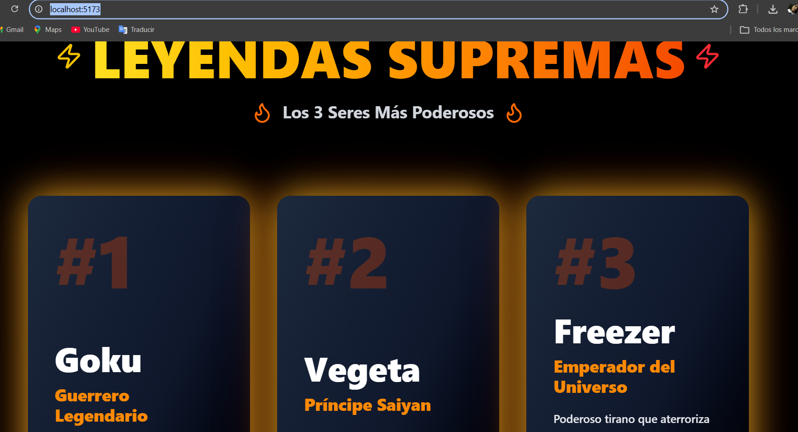

Sección "Leyendas Supremas" mostrando los 3 personajes más poderosos (Goku, Vegeta y Freezer) con cards interactivas consumidas desde la API de Dragon Ball.

# Desarrollo de Angie Portocarrero

## Descripción

Implementación de una aplicación web basada en PokéAPI utilizando React, TypeScript, Tailwind CSS y componentes de shadcn/ui para crear una landing page interactiva y visualmente atractiva.

### Evidencia 1: Ejecución inicial del proyecto

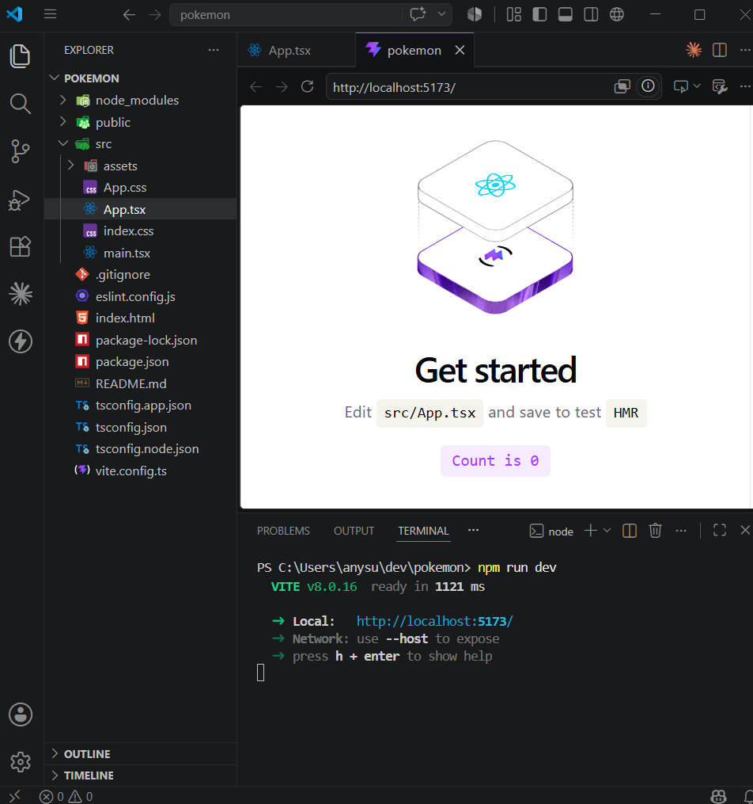

Se verifica la correcta ejecución del proyecto React generado con Vite.

### Evidencia 2: Implementación de la página principal

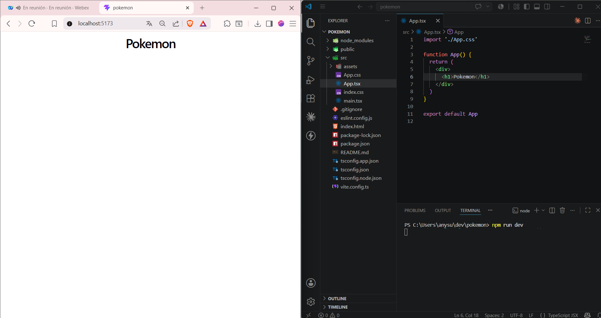

Desarrollo de la estructura base de la aplicación para el consumo de información desde PokéAPI.

### Evidencia 3: Integración de Tailwind CSS

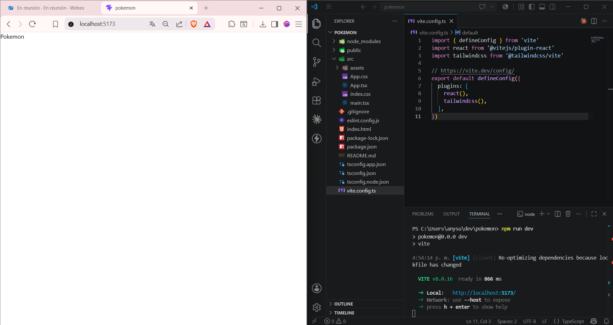

Configuración y aplicación de Tailwind CSS para mejorar el diseño visual del proyecto.

### Evidencia 4: Primera versión de la landing page

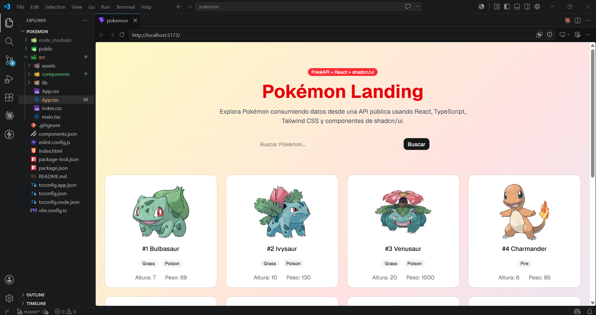

Implementación inicial de la interfaz y organización de los componentes principales.

### Evidencia 5: Versión final de la landing page

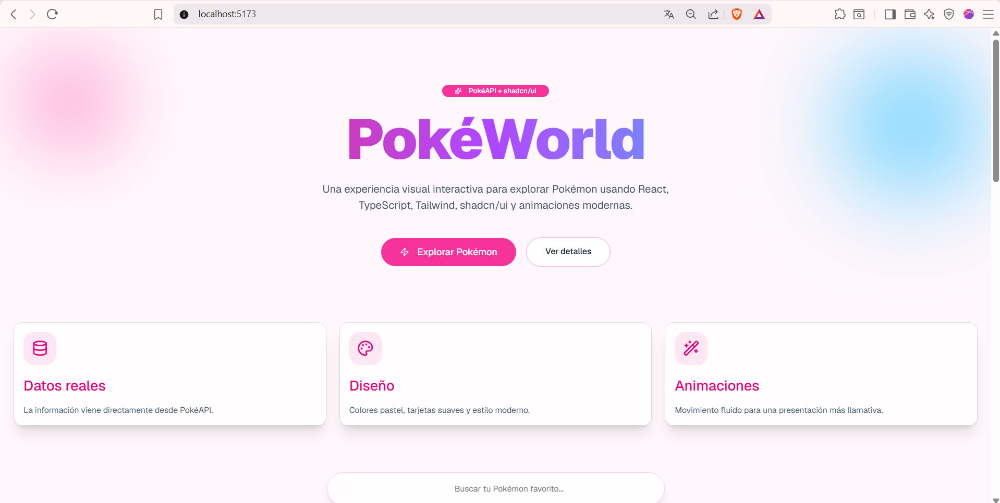

Versión final de la aplicación incorporando componentes de shadcn/ui, mejoras visuales y consumo dinámico de datos desde PokéAPI.

---

# Estructura del Proyecto

```text
src/
├── components/
├── assets/
├── lib/
├── App.tsx
├── main.tsx
└── index.css
```

---

# Conclusiones

1. React y TypeScript permiten desarrollar aplicaciones web modernas mediante una estructura basada en componentes reutilizables.

2. El consumo de APIs públicas facilita la integración de información dinámica dentro de aplicaciones web interactivas.

3. El uso de Tailwind CSS y shadcn/ui permite construir interfaces modernas, organizadas y adaptables a diferentes dispositivos.

4. Git y GitHub facilitan el trabajo colaborativo mediante el control de versiones y la integración de cambios entre los integrantes del equipo.

5. La división del proyecto por funcionalidades permitió desarrollar soluciones independientes manteniendo una estructura organizada dentro del repositorio.
